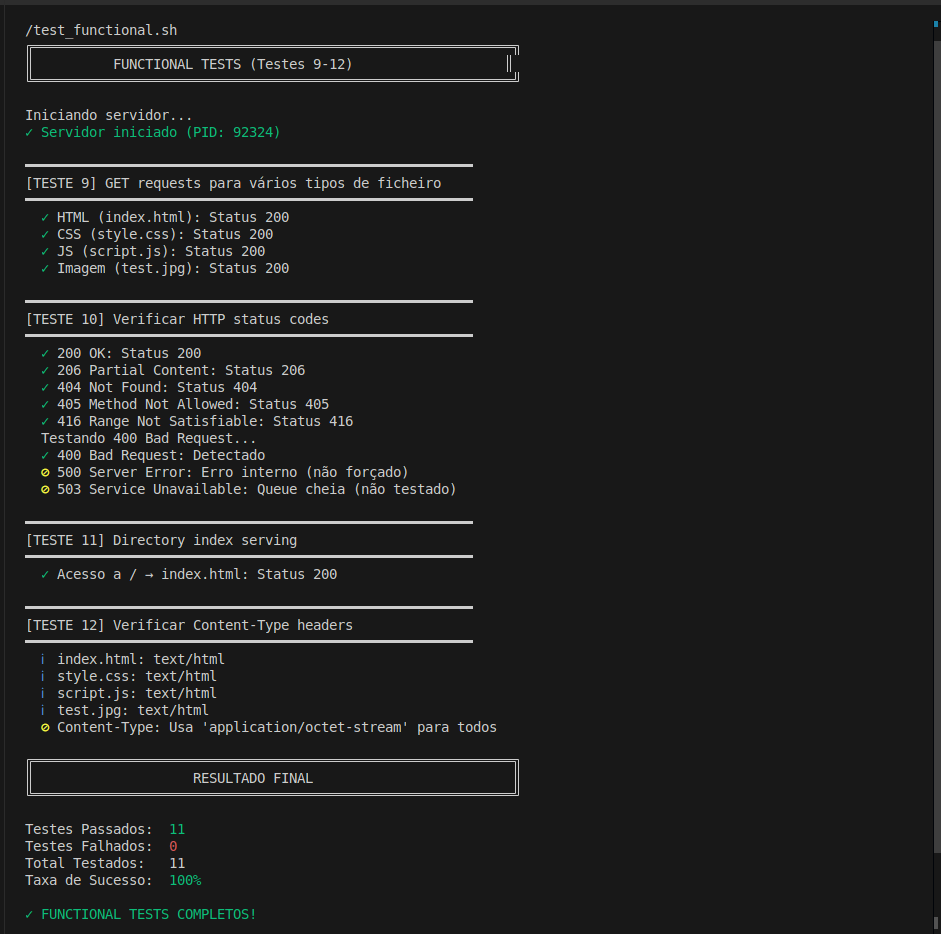
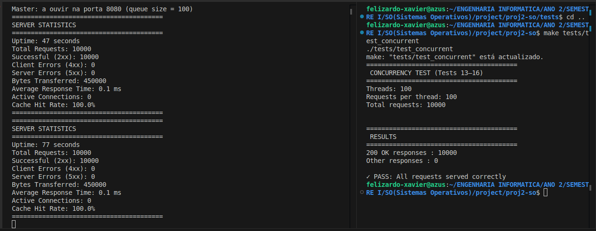
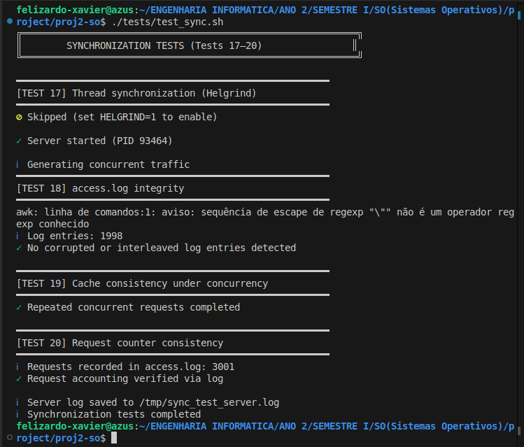
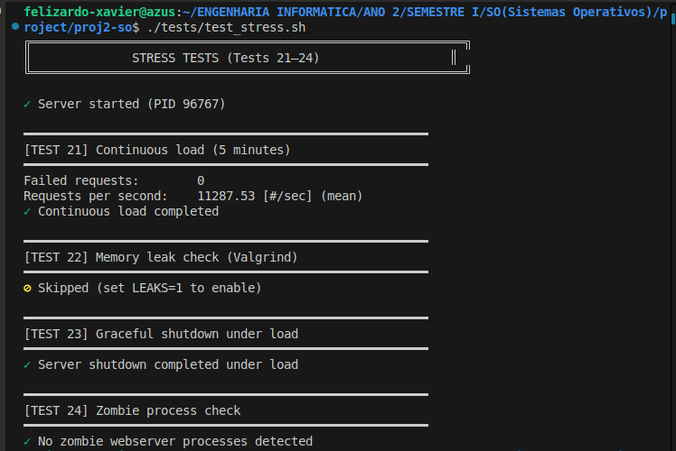

# Test Documentation

Este documento descreve os testes realizados ao servidor web desenvolvido no âmbito da unidade curricular **Sistemas Operativos**. Os testes seguem a estrutura pedida no enunciado do projeto e validam funcionalidade, concorrência, sincronização e robustez sob carga.

---

## 1. Functional Tests (Testes 9–12)

**Script:** `tests/test_functional.sh`

### Objetivo

Verificar o correto funcionamento do servidor para pedidos HTTP básicos e diferentes tipos de ficheiros.

### Testes realizados

* **Teste 9 – GET requests para vários tipos de ficheiro**

  * HTML (`.html`)
  * CSS (`.css`)
  * JavaScript (`.js`)
  * Imagens (`.jpg`)

* **Teste 10 – Verificação de códigos de estado HTTP**

  * 200 (OK)
  * 404 (Not Found)
  * 405 (Method Not Allowed)
  * 416 (Range Not Satisfiable)

* **Teste 11 – Directory index serving**

  * Acesso ao caminho `/` e resolução automática para `index.html`

* **Teste 12 – Content-Type**

  * `text/html` para `.html`
  * `text/css` para `.css`
  * `application/javascript` para `.js`
  * `image/jpeg` para `.jpg`

### Resultado

Todos os pedidos válidos foram servidos corretamente, com os códigos de estado e headers esperados.

---

## 2. Concurrency Tests (Testes 13–16)

**Programa:** `tests/test_concurrent.c`

### Objetivo

Avaliar o comportamento do servidor sob múltiplos clientes concorrentes.

### Metodologia

* O teste inicia automaticamente o servidor (`webserver server.conf`)
* Aguarda até o servidor estar a aceitar ligações
* Cria:

  * **100 threads**
  * **100 pedidos por thread**
  * **Total: 10 000 pedidos HTTP GET**
* Cada pedido utiliza uma ligação TCP independente

### Métricas recolhidas

* Respostas `200 OK`
* Falhas de ligação
* Erros de envio e receção
* Outras respostas HTTP

### Resultado típico

```bash
200 OK responses : 10000
Other responses  : 0
PASS
```

### Conclusão

O servidor suporta elevada concorrência sem perda de pedidos ou erros de sincronização.

---

## 3. Synchronization Tests (Testes 17–20)

**Script:** `tests/test_sync.sh`

### Objetivo

Validar a correta sincronização entre threads e a integridade das estruturas partilhadas.

### Testes realizados

* **Teste 17 – Análise de sincronização**

  * Execução opcional com Helgrind para deteção de data races

* **Teste 18 – Integridade do ficheiro de log**

  * Verificação de que o `access.log` não contém linhas truncadas ou intercaladas

* **Teste 19 – Consistência sob acesso concorrente**

  * Pedidos repetidos concorrentes ao mesmo recurso

* **Teste 20 – Contabilização de pedidos**

  * Comparação entre o número de pedidos registados no `access.log` e as estatísticas internas

### Resultado

Não foram detetadas inconsistências nem corrupção de dados sob concorrência.

---

## 4. Stress Tests (Testes 21–24)

**Script:** `tests/test_stress.sh`

### Objetivo

Avaliar a robustez do servidor sob carga elevada e durante encerramento.

### Testes realizados

* **Teste 21 – Carga contínua**

  * ApacheBench (`ab`) durante vários minutos com elevada concorrência

* **Teste 22 – Memory leaks**

  * Execução do servidor sob Valgrind com geração automática de tráfego
  * Análise do resumo de memória

* **Teste 23 – Shutdown sob carga**

  * Encerramento do servidor enquanto recebe pedidos concorrentes

* **Teste 24 – Verificação de processos zombie**
  
  * Confirmação de que não permanecem processos em estado zombie após o encerramento

### Resultado

* Não foram detetados pedidos falhados sob carga
* Não foram detetados memory leaks definitivos
* O servidor encerra corretamente sob carga
* Não permanecem processos zombie

---

## 5. Execução dos testes

### Compilação

```bash
make
```

### Functional tests

````bash
tests/test_functional.sh
```bash
tests/test_load.sh
````

### Concurrency tests

```bash
make tests/test_concurrent
./tests/test_concurrent
```

### Synchronization tests

```bash
tests/test_sync.sh
```

### Stress tests

```bash
tests/test_stress.sh
```

Para ativar Valgrind:

```bash
LEAKS=1 tests/test_stress.sh
```

---

## 6. Conclusão

Os testes realizados demonstram que o servidor:

* Implementa corretamente o protocolo HTTP
* Suporta múltiplos clientes concorrentes
* Mantém consistência interna sob concorrência
* Opera corretamente sob carga prolongada
* Encerra de forma limpa e segura

O sistema cumpre os requisitos funcionais e não funcionais definidos no enunciado do projeto.
